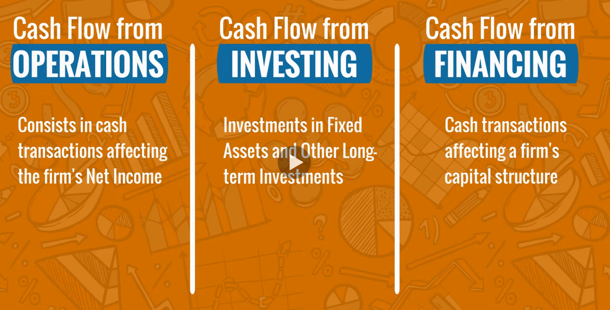
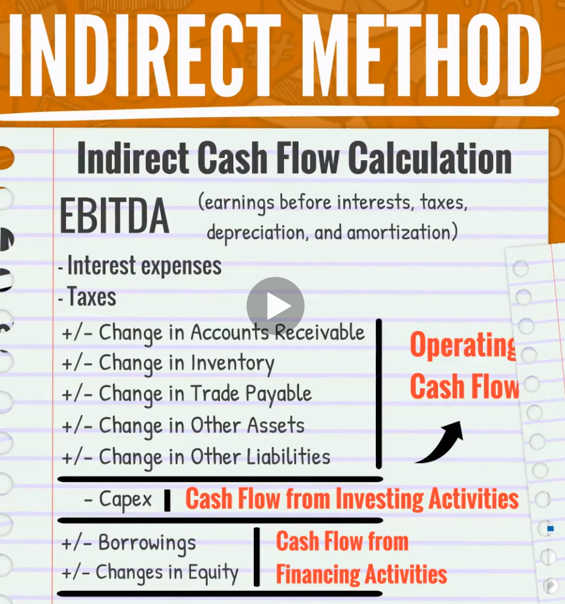

# The Complete Financial Analyst Course 2017
## 365 Careers, Org | Ned Krastev

# Welcome! Course Introduction
- First, we'll be working with Microsoft Excel.
- Then, we'll learning about Accounting.
- Then, we'll be going over Finance 101 topics.
- Finally, we'll discuss Powerpoint.
- Prizes, or whatever.

# Microsoft Excel - Quick Introduction
- The top part of the excel screen is called **The Ribbon**.
- On the bottom is **The Workspace**.
- The default number of columns is 16384.
- The default number of rows is 1048576.
- The plus button adds 'as many sheets as we like'.
- Below the *ribbon* and above the *workspace* are the **Name Box** and the **Formula Bar**.
- The *formula bar* will give you suggestions.
- Entering data requires selecting it, obv.
- To tell Excel that you're done entering data you can use *Tab*, *Enter*, or the *arrow keys*.
- Text is aligned left; numbers to the right.
- You can cancel an entry by pressing `ESC`.
- Pressing *F2* will move you to the *formula bar*.
- Pressing *DEL* will delete the contents of the selection.
- You can find **Formating** either by right clicking or in the *Ribbon*.
- You can press *CTRL+SPCBAR* to select a whole column.
- You can press *SHFT+SPCBAR* to select a whole row.
- Excel can also act as a calculator.
- To start a formula, you must start the box with either `=` or `+`.
- You can use **Cell References** to make formulas easier to understand.
- A window opens when you click on the **Function Button** which lists all functions broken down by category.
- **Paste Special** allows for detailed configuration of what precisely you want to copy.
- You can press *ALT+E+S* to do this.

# Microsoft Excel - Useful Tools
- You can push text onto a new row but inside the same cell using *ALT+ENTER*.
- **Text-To-Columns** *Data Tabular > Text To Columns*
- You can set up a **Print Selection Area** under the *Print Tabular*.
- You can force a cell's contents to wrap using the *Home > Wrap Text* option.
- To insert a *hyperlink* you'll navigate to *Insert > Hyperlink*.
- You can also use the keyboard short cut *CTRL + k*.
- You can link to a location in the same document as an option.
- A **Freeze Pane** will hold some rows or columns in place while you scroll.
- Excel 2016 contains a search bar to seek functions, etc.
- A **Pivot Table** is used to summarize or simplify a table in a sheet.
- You can access this feature by navigating to *Insert > Pivot Table*.

# Microsoft Excel - Best Practices
- I hate their formatting.
- To enable the **Developer Tab**, you navigate to *Right click View > Select "Customize the Ribbon"* and add it.
- An **Excel Macro** is a set of instructions that can be triggered by a shortcut, toolbar button or an icon.
- After naming and enacting it, you can rerun it by navigating to *Developer Tab > Macros* and selecting the one you want.
- To Enable **Fast Scrolling** use *CTRL + ARROW_KEYS* which will take you to the last non-blank cell.
- You can **Quick Select** by doing that but also holding down *shift*.
- If you double click on a cell reference in a formula then it should take you to that cell.
- If it doesn't then you'll want to enable it using *File > Options > Advanced > Disable Allow Editing Directly in Cells*
- Once this is done, you can press *F5+Enter* to jump back.
- If you want the reference to remain fixed, then add `$` before it.
- This needs to be applied per row/column if you never want it to move.
- **Special Select** allows you to select based on conditions.
- To use it, you select an area and then press *F5*.
- **Dynamic Naming** allows one field and have it updated elsewhere.
- You can do this using `="Text_here" & <Cell_Name>`
- You can name cells by selecting a set and then typing the reference name in the *Name Box*.
- Then, you can use that name in formulas.
- To create a **Drop Down Menu** you navigate to *Data Tab > Data Validation*.
- You will not be able to type new values unless you disable that effect under the same place.
- To create sorting on all columns in a table, navigate to *Sort & Filter > Custom Sort*.
- You can navigate the *Ribbon* by first pressing *ALT*; letters will be listed for each option.
- Example: *ALT+A+T* creates a filter.
- The **Quick ACtion Toolbar** allows you to add common commands to the title bar.
- You can also access that same bar using *ALT+[n]*, where n is the icons position in the title bar.
- Sometimes excel does not recognize a field as a number and you can multiply it by 1 and it will.
- Find and replace exists.
- Excel also allows you to find and replace formatting.
- The green tagged corners of cells are there to inform you that a calculation error took place.
- When you save and close a file, excel keeps your last position per sheet which is unprofessional.
- Just select cell A1 in all of them and then save it for **Beauty Saving**.
- **Conditional Formatting** services as a quick rule of them that aids in understanding data.
- Beware of the negative and positive values throwing off the range and therefore the colors.

# Microsoft Excel - Beginner, Intermediate, Adv. Functions
- The `if()` function is the foundation of many other functions so make sure you understand it.
- You can extend the formula bar by dropping down with the arrow at the end of the bar.
- The function `SUM()` is self evident.
- The function `SUMIF(range; criteria; [range])` uses the range to check, the criteria as the condition, and range to sum.
- The function `SUMIFS([range], range_1, criteria_1, ...)` is like `sumif()` but it accepts more than one condition or set of cells.
- The function `COUNT()` counts which cells are numbers.
- The function `COUNTA()` counts which cells have text.
- The function `COUNTIF([range]; condition)` will conditionally count items in the range.
- The function `COUNTIFS()` counts cells that meet conditions where the input is of form `[range]; condition; ...`.
- The function `AVERAGE()` does what you think it does.
- The function `AVERAGEIF()` does what you think it does but with a condition.
- You can slice a string and take only the first `<n>` characters using teh function `LEFT(Cell, Letters)`.
- The function `RIGHT()` does the same thing but from the end of the string.
- The function `MID(Cell, Start, N)` splices the text from `Cell` starting at `Start` and copies `N` characters.
- The function `UPPER()` will convert a string to all upper case letters.
- The function `LOWER()` will convert a string to all lower case letters.
- The function `PROPER()` will convert a string to proper case letters.
- The symbol `&` is the string concatenation function in excel.
- The function `MAX()` does what you think it does.
- The function `MIN()` does what you think it does.
- The function `ROUND()` does what you think it does.
- The function `VLOOKUP()` filters data based on what is passed first.
- The arguments are:
  1. `value`; what to find.
  2. `table`; table to pull data from.
  3. `index`; the column index to get the data from.
  4. `regex_bool`; Should the lookup allow for similar values.
- The function `HLOOKUP()` does the same thing but for rows instead of columns.
- The function `INDEX()` takes a selection area and returns the `x`,`y` values in relation to the table.
- The function `MATCH()` takes a value and a selection table to return the location.
- The function `IFERROR()` will substitute a value when an error is detected.
- The function `RANK()` will give you the rank of the ordered values in a column.
- The function `CHOOSE()` allows us to pass which row to substitute values for.
- **Sensitivity Analysis** allows you to explore the effects of multiple different parameters on a result.
- Fill in the hypothetical numbers and then navigate to *Data Tab > "What-If Analysis" > Data Table*.

# Microsoft Excel - Financial Functions
- A Dollar earned now is not the same as a dollar earned in the future.
- The **Net Present Value** is `Present_Value1 + .... Present_ValueN - Initial_Investment`.
- Excel has a function `NPV(interst_rate, [cashflow_range], )` to do this for you.
- Make sure to take the `SUM( init_invest, NPV(..))` to correctly calculate it.
- The **Internal Rate of Return** is a discount rate used for measuring the profitability of a potential investment.
- The acronym for **Internal Rate of Return** is IRR.
- The function `IRR()` is how you would do that.
- The **Future Value** is `Present_Value x (1 + i)`.
- The `PMT()` function will calculate the consistent monthly payment that is necessary to extinguish a loan in `<n>` periods.
- You can extract parts of dates using the functions `YEAR()`, `MONTH()`, `DAY()`.
- You can then use `DATE()` to convert numbers back into a date format.
- The function `EOMONTH()` takes a date and returns the last day after `<n>` months.
- The function `EDATE()` takes a date and returns the date after `<n>` months.

# Microsoft Excel - Practical Exercise "Build a P&L From Scratch"
- When dealing with a Profit and Loss, make sure that each year's data is consistent.
- To Left Align text using the keyboard press *ALT+H+A+L*.
- To add a Filter, you can press *ALT+A+T*.
- To delete rows, press *ALT+-*.
- To remove duplicate selections, navigate to *Data > Remove Duplicates*.
- Good formatting allows for users to understand the data faster.
- You can **Paste Special Formatting** using *CTRL+E+S*.
- You can use small x's or something else to serve as guard rails and run to the bottom of a sheet.
- It is normal for profits to be in negative and costs to be postive in these sheets.
- **Mappings** are a way in P&L sheets to group similar categories together to readability.
- The acronym *EBITDA* stands for **Earnings Before Interest, Taxes, Depreciations, Amortizations**.
- The formatting itself can be just as important as the content itself.
- The function `COUNTIF()` is a good way to test your work.
- There is some crazy formula on the screen that I am not going to copy.

# Microsoft Excel - Building Professional Charts in Excel.
- To add a chart, Select the data then navigate to *Insert > Select Chart Type*.
- Excel 2016 includes a **Recommended Charts** button.
- If you don't like the choice, you can **Right+CLK** and select **Change Chart**.
- When a chart is selected, the **Chart Tools Ribbon** shows up.
- A **Bridge Chart** shows how an initial value is affected by a series of intermediate positive values.
- The **Treemap Chart** helps us to visualize multiple categories against a numeric value.
- The **Sparklines** are miniature charts in a cell that helps you spot trends in data.
- You cannot use the *DLT* key to remove a sparkline and will need to delete the row or clear the cell.

# Creating Complete Professional Charts from Scratch
- Some visual examples of creating charts.

# Microsoft Excel - Working with Pivot Tables
- **Pivot Tables** are Excel's dynamic tables.
- Useful to summarize data.
- They're useful when dealing with data files over 20 MBs.
- The tables will not give access to the actual formulas.
- They don't update automatically when cell contents change.
- To refresh the Pivot Table after changes, right click and select *Refresh*.
- Excel generates the table using the function `GETPIVOTDATA()`
- You don't have to use hard values in the function; you can use a cell's contents instead.
- **Slicers** are filters than can be applied on top of a pivot table.
- You can use them by navigating to *Insert Ribbon > Slicers*.

# Pivot Tables & Slicers in Practice
- ERP stands for **Enterprise Resource Planning** and is common in Retail systems.
- The two largest providers in the world are SAP and Oracle.
- Beware of large files like the example used in these lectures.
- **Net Sales** is what actually goes into the companies back account.

# Modeling in Excel - Building a Complete 3-Statement Model
- You should always manually edit the **Conditional Formatting** rules.
- You can hide highlighted columns using *ALt + SHIFT + Right Arrow*.
- **Cost of Goods** is what *cogs* stands for.
- You can repeat the same command by pressing *F4*.
- You should never show Balance sheet value as if they cover the entire year.

# Modeling in Excel - Let's Build a Flexible Model With Multiple Scenarios
- The function `choose` will select an index based on the conditional values.
- **Days Sales Outstanding** = DSO
  * The average number of days a company takes to collect revenue after a sale has been made.
  * Trade Receivables / Revenue * 360
- **Days Payable Outstanding** = DPO
  * How long it takes for a company to pay its invoices from trade creditors.
  * Trade Payables / Cogs * 360.
- **Days Inventory Outstanding** = DSO
  * How long it takes for a company to turn its inventory into sales.
  * Inventory / Cogs * 360

# Modeling in Excel - Completing the 3-Statement Model
- when accounts use **Plant, Property & Equipment (PP&E)** then usually call it **Fixed Asset Roll Forward**.
- When approaching whether something is an Asset or a Liability, we need to be careful to place it correctly.

# Accounting - Introduction to Acct. & Bookkeeping
- **Accounting** is an information science that is used to collect and organize financial data for organizations and individuals.
- Four Main Areas of Accounting:
  1. **Bookkeeping**: Collection of Information.
  2. **Financial Accounting**: Prepared for External Stakeholders.
    * The three core statements are:
      1. Income Statement.
      2. Balance Sheet.
      3. Cash Flow.
  3. **Managerial Accounting**: Strategic Information available to insiders.
  4. **Tax Accounting**: Calculation of Income Taxes.
- Modern society cannot function without Bookkeeping.
- Financial statements are how a bank knows whether to lend money to a company.

# Accounting - Types of Revenue, Costs, Assets, Liabilities
- The acronym *UsGAAP* stands for **US Generally Accepted Accounting Principles**.
- The International Organization is called the **International Accounting Standards Board**.
- They produced the **International Financial Reporting Standards (IFRS)** .
- A Public Company in the EU are required to use *IFRS*.
- The three Financial Statements which we care about are:
  1. Profit and Loss
  2. Balance Sheet
  3. Cash Flow
- The **Income Statement** answers "How did the company perform?".
- The **Balance Sheet** answers "What does the company owe and own?".
- Reminder that Assets must be equal to Liability and Equity.
- The **Cash Flow Statement** answers "how much cash did the company make?".
- **Revenue**, or net sales, is an inflow of economic resources.
- The top line is *Total Revenue*; which is Net Sales + Other revenue.
- Most common expenses are:
  1. Cost of Goods sold.
  2. Selling, General, Administrative.
  3. Depreciation and Amortization.
  4. Interest Expenses.
- **Gross Profit** = Total Revenue - Cost of Goods.
- If you're Other Revenue is high, then it might be worth subtracting it to get a better estimate.
- Depreciation is the losses on psychical; Amortization is the loss on intangible assets.
- Some businesses will lean on EBITDA vs EBIT depending on their relationship to Depreciation and Amortization.
- The acronym *SG&A* stands for **Selling, General and Administrative Expenses**.
- **Depreciation** is the portion of an asset that is being used up over the course of its life.
- This is shown as an expense since it is being used.
- There are two kinds of depreciation: **Straight Line** and **Based On Use**.
- For the *Straight Line* method, you would calculate the *Initial Asset Cost* - *Salvage Value*.
- For *Based On Use*, you would use the expected lifetime of the Asset.
- A similar process is applied to **Intangible Assets** such as Software,Brands,Goodwill,Artistic Assets.
A *Balance Sheet* has two sides:
  1. Assets.
  2. Liabilities and Equity
- Assets stand on the left; Liabilities and Equity on the right.
- **Accounts Receiveable** is the amount of money that others owe the company.
- Businesses can claim Prepaid expenses as Assets on their Balance sheets.
- **Accounts Payable** are some of the most important lines in the Balance Sheet on the right side.
- **Financial Liabilities** is where the company gets money from external entities.
- Debts which are greater than 180 days should be placed under *Financial Liabilities* since it's really a loan with that length.
- **Ownership Claims** is capital that is owed to shareholders.
- The **Equity** column is broken into:
  1. **Paid-In Capitcal**: the firm's starting capital.
  2. **Retained Earnings**: The accumulated earnings which have not been distributed.
  3. **Current Profit**: What was made this year.

# Accounting - Revenue Recognition
- There is a very real difference in what is recorded and the actual transactions.
- **Accrual Accounting** is the idea that revenues and costs should not be registered when cash is exchanged but should when costs are incurred.
- The main criteria for when a payment is made is:
  1. If the work is done.
  2. If the seller company receives a valid promise of payment.
- This is not the same as the *IFRS* which has five:
  1. Risks and rewards have been transferred from the seller to the buyer.
  2. The seller has no control over the goods sold.
  3. Collection of Payment is reasonably assured.
  4. The amount of revenue can be reasonably measured.
  5. Costs of earning the revenue can be reasonably measured.
- A **M&A Transaction** stands for a Merger and Acquisition transaction.
- Since the pressure to report income not yet earned is so high, both internal and external companies will audit businesses.

# Accounting - Cost Recognition
- The **Matching Principle** is when you have the costs and revenues registered to the same period.
- There are usually two kinds of P&L statements for companies.
  1. Single
  2. Multistep
- A **Single Step P&L** is called this because there are no intermediary results.
- A **Multistep** is the one with intermediary results like the ones we've been taught outlining the difference in Cost of Goods and Gross profit.

# Accounting - Understanding the Big Picture: Why, What, When, How Much.
- The amount of sales a company makes is a measure of how large its business is and how it performed compared to previous periods.
- Questions:
  1. Did the company grow?
  2. Did it grow faster than other competing businesses?
  3. Is the business slowing down?
  4. How likely will that performance continue?
- If revenue is recognized earlier rather than later then it improves how a business appears.
- These rigid rules are enforced to allow everyone to make reasonable judgments about a company.
- The **Matching Principle** that expenses incurred to generate revenue are recognized in the same period as the revenue.
- If sales are made in a period, then the costs for those sales must also be in that period.
- **Period Costs** are ones that may be excluded; items such as Admin costs, utility bills.

# Accounting - The Core Principles of Accounting
- A good definition of a **Balance Sheet** is a record of what a company owns and owes in a specific period of time.
- Both sides of this equation must be equal.
- The **Accounting Equation**: Assets = Liabilities + Equity.
- A **General Ledger Account** is an account that allows us to organize the information about a firm's balance sheet or income statement items.
- *General Ledgers* usually have subsidiary ledgers.
- The T-Account format is the most common used in Accounting.
- We can think of the *Balance Sheet* as one really big T-Account.
- The elements of a **T Account**:
  * The Title at the top.
  * Debit is the left.
  * Credit is the right.
- There are also T-accounts for Income Statements.
- The basis of **Double Entry** bookkeeping is that every transaction has an equal and opposite effect in at least two accounts.

# Accounting - Practical Exercise: The Accounting Transactions of a Lemonade Stand.
- The first thing most businesses do is to commit Equity Capital.
- When balancing the T-accounts, if it is on the right side then you subtract the left side from the right side.
- Good set of lectures to watch for review.

# Accounting - The Importance of Timing
- Sometimes a firm may recognize revenues or expenses at a time that is different than the time when the actual payment has been made.
- Cash may come before, at or after the sale of a project.
- Revenue is recognized when the product is transferred.
- If a client pays **at** the time of delivery: Debit cash, Credit Revenue.
- If a client pays **after** the time of delivery: Debit Trade Receivables, Credit Revenue; At Payment: Credit Trade Receivables, Debit Cash.
- If a client pays **before** the time of delivery: Debit cash, Credit Prepaid Revenue; At Delivery: Debit Prepaid Revenue; Credit Revenue.
- **Accrual Accounting** is when *Revenues* are not always recorded at the same time as the exchange of cash.

# Accounting - Preparing a Cash Flow Statement: Understanding Cash Flow Analysis
- It can be confusing to see a business that is making a profit run out of money.
- Cash flow generation and liquidity are vital to all businesses.
- A company must be able to measure the actual amount of money it makes and estimate its future capital needs.
- The **Cash Flow Statement** indicates whether cash is made to service existing debt.
- It shows the amount of money that is being invested.
- It shows whether the firm can invest in new opportunities when they arise.
- Types of **Cash Flow Activities**:
  1. **Operations**: affecting the firms Net Income.
  2. **Investing**: affecting Fixed Assets and long term Investments.
  3. **Financing**: affecting firms capital structure.

- A company might have very high leverage which can cause a business to fail.
- **Net Cash Flow** is the Ending Balance cash balance from the previous period minus Beginning Cash Balance.
- Two methods of presenting *Net Cash Flow*:
  1. **Direct**: all cash payments the firm has made in the period.
  2. **Indirect**: Net Income is converted to cash flow that affect Net income but no immediate cash effect.
- Almost all companies use the indirect method.
- It has a few affects:
  * Eliminination of a non-cash expenses.
  * Changes in the Balance Sheet accounts deriving from the application of Accrual Accounting.
- It starts with Net Income or EBITDA which will exclude non-cash items.
- *Capex* stands for **Capital Expenditures**

- We must add back D&A if the cash flow format we use starts from EBIT or Net income.

# Advanced Accounting - Trade Receivables
- If companies allow people to buy on credit, then this is a kind of investment.
- Therefore, high Trade Receivables can be a dangerous element on the Balance Sheet.
- If a company does a poor job of collecting on the receivables then that number will grow quickly.
- If the party does not pay then the contract usually stipulates an interest which gets added to the Accounts Receivables.
- If the party files for Bankruptcy then it will have to go to Debt Collectors.
- Often though, the entire amount is irrecoverable.
- When this happens, you credit the Trade Receivables account and then add a irrecoverable Debt line to the P&L.

# Advanced Accounting - Inventory
- Having two much inventory can be a real problem.
- Retail level companies usually only have **Finished Goods**.
- Other companies can have three kinds:
  1. Raw Materials.
  2. Work-In-Progress Goods.
  3. Finished Goods.
- There are some services - such as Facebook - which has no Inventory at all.
- The **Cost of Goods Equation** is straight forward: [Beginning Inv.] + [Purchased Goods] - [Ending Inventory].
- If there are different prices for the same product in the Warehouse, then how you record those numbers depends on the **Cost Flow Method**.
- There are three methods according to the IFRS:
  1. Specific Identification.
  2. First-in, First-out
  3. Weighted Average Cost.
- There is a fourth option for USGAAP called *Last-in, First-out*.

# Advanced Accounting - Fixed Assets
- There are three kinds of Fixed assets:
  1. Tangible Assets
  2. Intangible Assets
  3. Financial Assets.
- The **Capitalizatinon** of assets should be depreciated over the course of the years it exists.
- In most districts, if we Capitalize an asset then we postpone its deduction and therefor the Taxes are higher.
- Draining internal capital can be stressing and therefore it is common to seek external capital.
- If a company owns property and the cost has changed, then they have to choose whether to record it at its historical value vs Present value.
- However, once selected they cannot switch it based on the assets and must apply it across all items in the category.
- **Fair Value Accounting** is not applicable to all types of assets and liabilities.
- **Intangible Assets** can be either finite or infinite.
- **Impairment** is done by a specialist and compares the current market value of a brand against its balance sheets.
- Beware that USGAAP does not allow for *Fair Value Accounting*.
- If a company does choose to do this then they have to apply a **Revaluation Model**.
- Typically, the capital expense of intangible assets is dispensed immediately.
- In IFRS, you *expense* Research and *capitalize* with Development.
- In USGAAP, you *expense* both.
- The exception to this would be Software R&D which can be *capitalized* when the technological feasibility has been established.

# Advanced Accounting - Trade Payables
- It all comes down to who is more desperate to make a deal.
- The two largest reasons for the delay is bargaining power and availability of alternatives.
- If a **Promissory Note** is involved then it will be registered as **Notes Payable.**

# Advanced Accounting - Financial Liabilities
- There a are two kinds of Financing: **Shareholders** or **Third-Party**.
- **Convertible Bonds** are bonds with the option to be converted into Equity and are interest bearing.
- Loans are calculated using the Amortization calculations.
- The loan is amortized according to the Market Rate.
- Sometimes when taking loans from banks, they'll be concerned with how the company will behave over the course of the loan.
- There are three kinds of **Debt Covenants** that a bank loan can attach:
  1. Positive: Action borrower to specific options.
  2. Negative: Action borrower to avoid specific options.
  3. Financial: Action borrower to a specific condition.

# Advanced Accounting - Leasing Liabilities
- An attractive point for some leasing facilities is no down payment.
- An advantage of leasing is that it can be kept off the balance sheet then it is an Operating Lease.
- Another advantage is that they are tax deductible.
- When dealing with a lease, we should think of it in terms of amortization.

# Advanced Accounting - Using Leverage
- A highly leveraged business will be more profitable if everything goes well.
- This is why aggressive investors prefer High Leverage deals.
- You can calculate the **Cost of Debt** for a company using [Interest Expense] / [Financial Liabilities]

# Advanced Accounting - Raising Equity, Types of Equity, and Dividend Payments.
- Remember that **Retained Earnings** are the profits which have not been redistributed to shareholders.
- **Non-Controlling Interest** is minority shareholders pro-rate ownership of a firm's equity.
- There are two main kinds of firms: **Private** and **Public**.
- Usually, the first investors in a company are the Founders.
- Sometime, Start ups will get equity from Angel Investors or Venture Capitalists.
- Business Angel's are private investors which have similar ideas.
- Sometimes, they can also serve as mentors.
- If the firms feels it needs more capital then it can do a **Seasoned Equity Offerring (SEO)**.
- **Dividends** are the main method for which investors get paid.
- **Special Dividends** are an extra payment under special circumstances.
- When dividends are paid, then assets decrease.
- A Share buyback can be a signal to the market of a position of strength.
- It could also be a signal for a lack of investment opportunities.
- A Company might want to keep its stocks within a specific valuation range and would therefore split it.
- A stock split may cause higher brokerage fees.

# Financial Statement Analysis - An Introduction

# Accounting - Subtleties of Financial Statement Analysis

# Accounting - Practical Case Study

# Fundamentals of Business & Financial Analysis

# Finance 101 - The Time Value of Money and Interest Rate Components

# Finance 101 - The Value of Cash Flows With Different Timing

# Finance 101 - Loan Calculations

# Capital Budgeting - A Complete Case Study

# Powerpoint - An Introduction

# Powerpoint - Tips and Tricks

# Research:
- Recharges?
- Direct Costs?
- Check if companies are abusing Other Revenue to float the Groos Profit.
- FASB?
- IASB?
- Vertex One?
- Stock vs Liquid Dividends?

# Reference:
