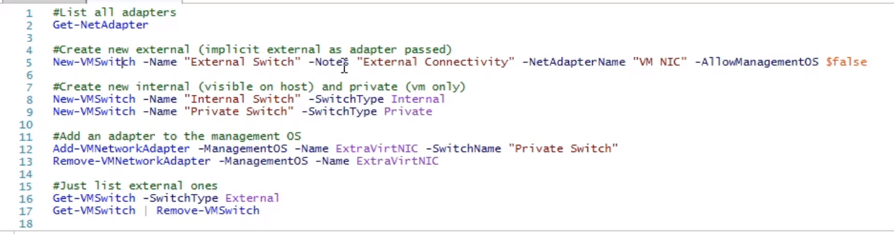
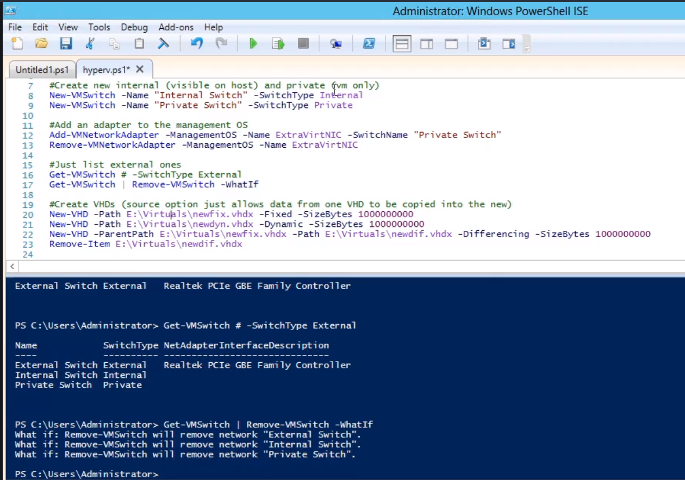
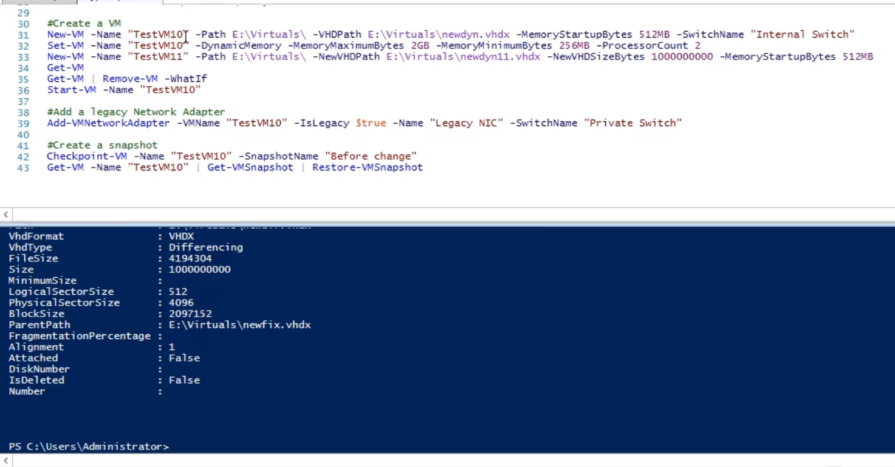
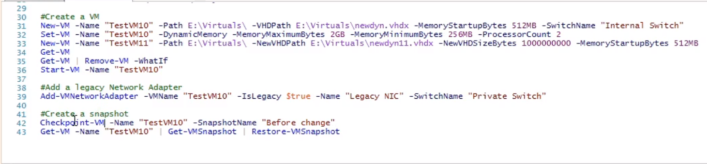
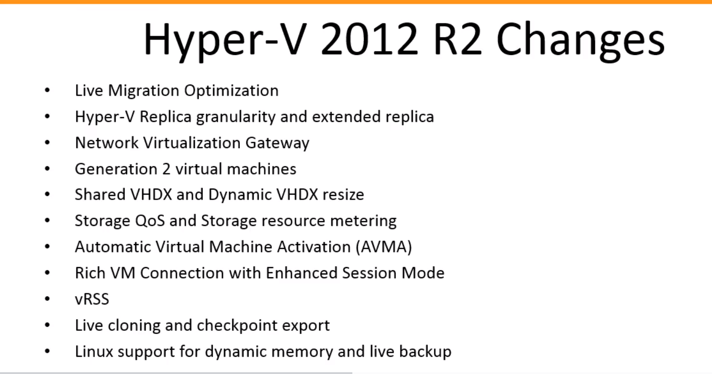

# Microsoft Windows Server 2012 Certification
##

# Key Windows Server 2012R2 Principles

# Deplyting Windows Server 2012

# Manage Windows Server 2012

# Internet Protocol v4

# Dynamic hoist Configuration Protocol

# Domain Name Services

# Internet Protocol v6

# File and Print Services

# Active Directory Deplymoent and Management
- Windows Computers are default in a WORKGROUP.
- It has it's own security SAM file.
- When a device is logging into a domain, it still retains its local SAM file.
- But, when using resources it is using the SAM of the AD server.
- This was limiting though and it 2000, Microsoft introduced **Active Directory**.
- Due to LDAP implementation, anything that is an LDAP client can use and query the AD Server.
- The name of the Active Directory databse is *ntds.dit* and can be found usually in ../System32
- **Global Catalog Servers** are most useful when you have multiple domains.
- It is there to assist with searches by storing common attributes of every object in all of the domains.
- There are 5 Partitions to any one Domain:
  1. Configuration.
  2. Schema: Blueprint of the Active Directory.
  3. The Domain Itself.
  4. Forest DNS Zone.
  5. Domain DNS Zone.
- A **Domain** is really just a grouping of objects.
- It contains:
  * Computers
  * Users
  * Groups
  * Organizational units.
- In the past, you could manually define relationships between different Domains.
- When you create a new domain and specify a parent, then it will become part of that domain's tree.
- When this happens, the parent's name **must** show up in the child's name.
- Trust is transitive between the parent and the child.
- This means that all domains in a Tree have an implicit transitive trust relationship will all other nodes in the tree.
- A **Forest** is what allows us to have different namespaces but the trust relationship can be transitive at the root nodes of the trees.
- At the domain level, you can raise the **Domain Functional Level**.
- This will limit what the lowest level in the ADs is allowed to be.
- This is also possible at the Forest Level.
- Once AD is installed, you will be able to promote the server to a Domain Controller:

- While setting these up, sometimes you can see the Powershell script that will be run by Windows to set evertyhing up.
- You can create a copy of the AD database from Powershell using the ntdsutil command.
  1. `ifm` //install from media.
  2. `create <NAME> full c:\ifm`
- Some operations don't handle Multi-Master mode well.
.
- The **Relative ID Master (RID)** is who is responsible for creating the relative IDs.
- This is what gets appended to the SID of the Domains.
- The **Primary Domain Controller (PDC)** used to be critical since it held the writable copy of AD.
- It is critical to keeping time synced across the domains.
- Kerberos is what allows the transitive trust so time must be within 5 minutes at all times on all servers.
- When a password change is made, the change is propagated to the PDC immediately.
- Group Policy should always be targeted at the PDC to avoid changes being out of sync.
- It is common for the PDC and the RID to be on the same server.
- The **Infrastructure Master** really only has a job if you have more than one Domain.
- It is responsible for maintaining the phantom records for group membership.
- Remember that it should not be a Global Catalog due to the necessity of comparing itself to other domains.
- The **schema Master** is reponsible for allowing and retaining changes to the schema.
- This will not be there by default; you will need to add it at the command line using `regsvr32 schmmgmt.dll`.
- Prior to Kerberos, NTLM was the primary form of authentication.
- Now, after a Client is logged in they are given a Ticket Granting Ticket to use for resources.
- Since Kerberos will need to hop up the tree and down another, you can setup **Shortcut Trusts** to cut long paths between common resource requests.
- For external trusts, you can select unidirectional or bidirectional to limit risk.
- **Active Directory Users and Computers** is the primary tool used to manipulate users and Computers.
- **Active Directory Sites and Services** is to manage the actual AD servers themselves.
- Inside a Domain, the servers create a replication ring that is always 3 hops or less.
- This is not true for Different Sites which you can configure via a a Site Link.
- **Active Directory Domains and Trusts** is used to manage trusts between domains.
- This where you will make manual trusts.
- Windows Server 2008 R2 added the **Active Directory Administrative Center**.
- Another useful tool is `adsiedit` which allows you to query the different partitions of Active Directory.
- You can check the replication status using `repadmin /showrepl`.
- You can force a sync using `repadmin /syncall`
- You can check the health of the Servers using `dcdiag`.
- Active Directory is actually split into two parts:
  1. Active Directory.
  2. Sysvol.
- Where Sysvol is focused on login scripts and Group Policy.
- Every object in Active Directory has its own Access Control List.
- There are two things that can be done with **Organizational Units**:
  1. Delegation of Authority.
  2. Group Policy Objects.
- You can then apply those to groups.
- You can turn on **Advanced Features** here:

- This will allow you to modify the Attributes of objects.
- While you can configure this all manually, you really should create a template user to copy from.
- You can also modify attributes on multiple objects while highlighting over them.
- There are a *lot* of built in accounts into Active Directory.
- These are accounts should be found in Builtin folder.
- Many users are added to the **Domain Administrator** but it should only be people you trust.
- When you join a computer to a Domain, it will have an object created for you.
- It is possible using `redircmp` to assign the newly joined computers to a default Group that is not Computer.
- Keep in mind that each object has a unique GUID and if you delete and re-create it then it is still not the same object.
- When you delete an object, it doesn't actually delete it.
- One of the useful functions we have to join to a domain is `djoin`.
- The **Distinguished Name** is a an indetifier for objects comprised of *Organizational units*
- You can export the object to csv using `csvde -f <filename> -d <distinguished-name>`.
- The command `get-aduser` can be used to find user objects:
```
get-adusedr -Filter {name -eq "Dick Grayson}"
```
- You can chain to AD commands to apply to those objects.


# Using Group Policy
- The components that make up a Group Policy are User Configuration and a Group Configuration.
- There are **Policies** and **Preferences**.
  * *Policies* are Enforced and if changed, will re-apply.
  * *Preferences* are set defaults but not enforced.
- All of these configurations are saved in .admx files.
- These can be found in `C:\Windows\PolicyDefinitions`
- It is annoying to have these managed on each system so it is recommended to have a Central Store for them.
- When Policies are applied, they are done in Descending order.
- You can take backups of and import from those backups of Group Policy Objects.
- You can force a refresh of GPO on a client computer using `gpupdate`.
- You can query the results of that update via `gpresult`


# Hyper-V
- Now we're going to talk about Virtualization - which we usually think of as Server virtualization.
- Server Virtualization breaks the bond between the OS and the hardware.
- To run these, your hardware will need to support this:
    * AMDs is called AMD-VT
    * Intels is called Intel-VT
- Once you're ready, you'll want to open **Server Maanger** and install the Role **Hyper-V**.
- To be useful, these virtual guests will need to be able to talk to one another as well as outside the host.
- Through the **Virtual Switch Manager**, we can create three different kinds of switches:
    1. External.
    2. Internal.
    3. Private.
- For *External*, this maps to a real NIC on the host machine.
- For *Internal*, this is only visible to Hyper-V and the guests.
- For *Private*, this is only visible to the Guests.
- You can get a list of adapters using the `Get-NetAdapter`:

- You can append `-WhatIf` to a command that is a Dry Run with no changes.
- With a **Syntthetic Network Adapter**, you will get the best performance since it's running at kernel level and is very fast.
- You cannot PXE boot over the network to a Synthetic Network Adapter.
- To do this, you will need a **Legacy Network Adapter**.
- Each VM can have up to twelve different Virtual NICs: 8 Synthentic and 4 legacy.
- There ia also another which is very new called **SR-IOV**.
- This allows it to pretend it is many NIC adapters and bypasses the virtual switch - further increasing performance.
- You can also add Extensions to the Virtaul Switches.
- Windows Server 2012 introduces the VHDx format.
- The old format - VHD - had a limit of 2TBs.
- This sometimes caused Disk Passthrough to be used instead.
- VHDX also gives you as good performance as a Bare Metal Drive.
- You can also create the them via powershell:

- Dynamic was not prefered with VHD since the write penalty was painful on performance.
- The Goal of a Difference Disk is that you have a master copy OS that you can use as a base.
- Then, you can create VMs with different disks but all dependent on that original disk - which will not be changed.
- You can also natively mount them in 2012 by double clicking on the VHDs.
- You can mount and unmount VHDs using Powershell using `Mount-VHD -Path <path-to-disk>` and `Unmount-VHD -Path <path-to-disk>`.
- You can also use **Edit Disk** option to compact, convert or Expand virtual disks.
- For Storage Devices, there are two different kinds of Buses: IDE and SCSI.
- Hyper-V requires the the boot to be an IDE Controller since it's emulated and not Synthetic.
- SCSI is however synthetic and will get the best performance.
- Another advantage is that you can hot-add disks while the VM is running to the SCSI Controller.
- Creating a new virtual machine is as simple as New > Virtual Machine.
- While we're doing it from scratch, creating a bunch of templates would be the better way to do this.
- Once it was online and patches, you would run `sisprep` to remove the SID and GUID to allow it to be used for other machines.
- You can also do all of the create of the VM Template using powershell:

- There are three primary values we configure for RAM in a VM guest:
    1. The startup RAM.
    2. The minimum RAM.
    3. The maximum RAM.
- With Dynamic Memory Allocation, Hyper-V inserts a Balloon Driver that will hold and claim memory inside to the guest as long as it is not really being used.
- You can also configure **Smart Paging File Location** which will act as extended RAM for the Guest OS.
- You can also reserve CPUs for the Virtual host - but this is not the default.
- A **Snapshot** is a point in time version of a Virtual Machine.
- This allows you to have a fall back point before applying patches, installing software, etc.
- You can, of course, do all of this from powershell:

- Prior to Windows 2012, to connect to a SAN you would need to use iSCSI.
- With **Virtual Fibre Channel** it is possible for them to connect directly to via the NIC.
- We create a new Virtual SAN in Hyper-V.
- To get the full access to all Operations, you'll want to install the Integration servies.
- To do this, you'd start the VM and select Action > Insert Integration Services Setup Disk.
- This is located at `C:\Windows\system32\vmguest.iso`.
- For Linux, you'll want to go download them instead for full Integrated Services.
- These allow us to enable or disable extended Integration Services - such as Backup or Heartbeat.
- Another is the setting *Backup (Volumesnapshot)* which informs the Guest that a VSS backup is taking place and changes should be flushed to disk.
- You can also create reports in **Performance Monitor** which allows you to track which and what resources are being used by which host.
- Windows Server 2012 comes with a new Metering Service which can be turned on using `Enable-VMResourceMetering -VMName <name>`. 
- You can then ask for the resource usage using `Measure-VM -Name <name>`.
- You can do live migrations within Hyper-V under **Hyper-V Settings** > Live Migrations.

- What are the differences between Generation 1 vs Generation 2 VM?:
    * Lots of the legacy devices have been removed from Generation 2.
    * You can boot from an SCSI Controller.
    * You can PXE boot from a Synthetic Controller.
    * It is also a UEFI based machine.
    * Linux is not Supported.
- While the performance of each is the same, booting is basically faster.
- **Enhanced Session Mode** is built on top of the old VM Connection to allow for extended configuration options while connected to a VM.
- To use this, the Guest OS must support the Remote Desktop Services.
- The Hyper-V Settings must be configured to **Allow Enhanced Session Mode** as well as on the User Section.
- The System Device which will tell you if this is available in the host is called **Microsoft Hyper-V Remote Desktop Control Channel**.
- Also, Snapshots have been renamed to Checkpoints.
- It is possible to **NIC Team** inside Hyper-V now - even though this is usually done at the host level.


# Summary
- Skip.


# Research:
- `w32tm /query /configuration`?
- `regsvr32`?
- `repadmin`?
- `redircmp`?
- `redirusr`?
- `dsmod`?
- `netdom reset`?
- `djoin`?
- When upgrading domains, you can pass a lot of options to `adprep`.
- When setting up a forest, you'll only need to run `adprep /forestprep` once.
- When setting up a domain, you'll only need to run `adprep /domainprep` once.
- Download GPO spreadsheets?
- `gpresult` ?
- Coreinfo util?
- `bcdedit`?
- RamMap?
- Setup Fibre Channel in Hyper-V?
- Service Manager Console?
- Hyper-V Replication?
- SMB Direct?
- IOPS?


# Reference:
