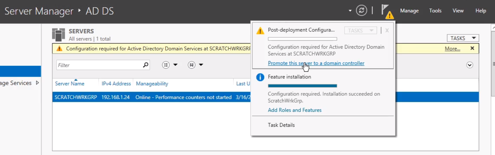
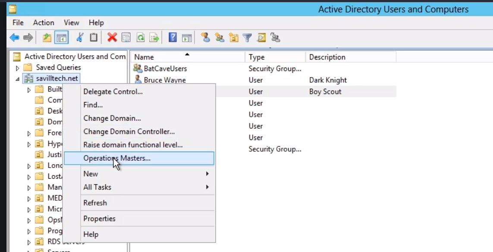
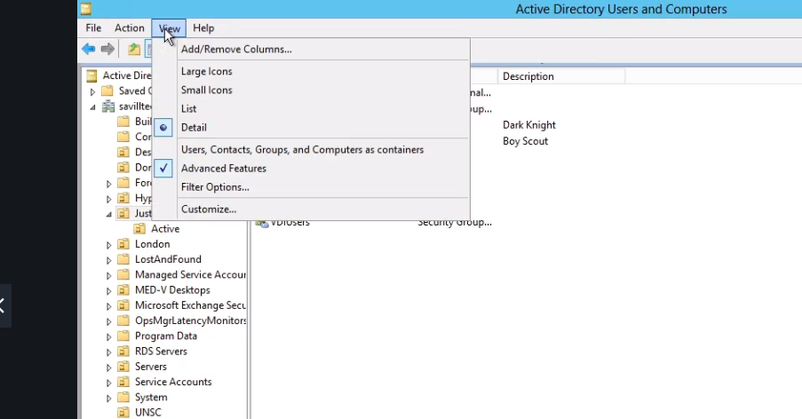

# Microsoft Windows Server 2012 Certification
##

# Key Windows Server 2012R2 Principles

# Deplyting Windows Server 2012

# Manage Windows Server 2012

# Internet Protocol v4

# Dynamic hoist Configuration Protocol

# Domain Name Services

# Internet Protocol v6

# File and Print Services

# Active Directory Deplymoent and Management
- Windows Computers are default in a WORKGROUP.
- It has it's own security SAM file.
- When a device is logging into a domain, it still retains its local SAM file.
- But, when using resources it is using the SAM of the AD server.
- This was limiting though and it 2000, Microsoft introduced **Active Directory**.
- Due to LDAP implementation, anything that is an LDAP client can use and query the AD Server.
- The name of the Active Directory databse is *ntds.dit* and can be found usually in ../System32
- **Global Catalog Servers** are most useful when you have multiple domains.
- It is there to assist with searches by storing common attributes of every object in all of the domains.
- There are 5 Partitions to any one Domain:
  1. Configuration.
  2. Schema: Blueprint of the Active Directory.
  3. The Domain Itself.
  4. Forest DNS Zone.
  5. Domain DNS Zone.
- A **Domain** is really just a grouping of objects.
- It contains:
  * Computers
  * Users
  * Groups
  * Organizational units.
- In the past, you could manually define relationships between different Domains.
- When you create a new domain and specify a parent, then it will become part of that domain's tree.
- When this happens, the parent's name **must** show up in the child's name.
- Trust is transitive between the parent and the child.
- This means that all domains in a Tree have an implicit transitive trust relationship will all other nodes in the tree.
- A **Forest** is what allows us to have different namespaces but the trust relationship can be transitive at the root nodes of the trees.
- At the domain level, you can raise the **Domain Functional Level**.
- This will limit what the lowest level in the ADs is allowed to be.
- This is also possible at the Forest Level.
- Once AD is installed, you will be able to promote the server to a Domain Controller:

- While setting these up, sometimes you can see the Powershell script that will be run by Windows to set evertyhing up.
- You can create a copy of the AD database from Powershell using the ntdsutil command.
  1. `ifm` //install from media.
  2. `create <NAME> full c:\ifm`
- Some operations don't handle Multi-Master mode well.
.
- The **Relative ID Master (RID)** is who is responsible for creating the relative IDs.
- This is what gets appended to the SID of the Domains.
- The **Primary Domain Controller (PDC)** used to be critical since it held the writable copy of AD.
- It is critical to keeping time synced across the domains.
- Kerberos is what allows the transitive trust so time must be within 5 minutes at all times on all servers.
- When a password change is made, the change is propagated to the PDC immediately.
- Group Policy should always be targeted at the PDC to avoid changes being out of sync.
- It is common for the PDC and the RID to be on the same server.
- The **Infrastructure Master** really only has a job if you have more than one Domain.
- It is responsible for maintaining the phantom records for group membership.
- Remember that it should not be a Global Catalog due to the necessity of comparing itself to other domains.
- The **schema Master** is reponsible for allowing and retaining changes to the schema.
- This will not be there by default; you will need to add it at the command line using `regsvr32 schmmgmt.dll`.
- Prior to Kerberos, NTLM was the primary form of authentication.
- Now, after a Client is logged in they are given a Ticket Granting Ticket to use for resources.
- Since Kerberos will need to hop up the tree and down another, you can setup **Shortcut Trusts** to cut long paths between common resource requests.
- For external trusts, you can select unidirectional or bidirectional to limit risk.
- **Active Directory Users and Computers** is the primary tool used to manipulate users and Computers.
- **Active Directory Sites and Services** is to manage the actual AD servers themselves.
- Inside a Domain, the servers create a replication ring that is always 3 hops or less.
- This is not true for Different Sites which you can configure via a a Site Link.
- **Active Directory Domains and Trusts** is used to manage trusts between domains.
- This where you will make manual trusts.
- Windows Server 2008 R2 added the **Active Directory Administrative Center**.
- Another useful tool is `adsiedit` which allows you to query the different partitions of Active Directory.
- You can check the replication status using `repadmin /showrepl`.
- You can force a sync using `repadmin /syncall`
- You can check the health of the Servers using `dcdiag`.
- Active Directory is actually split into two parts:
  1. Active Directory.
  2. Sysvol.
- Where Sysvol is focused on login scripts and Group Policy.
- Every object in Active Directory has its own Access Control List.
- There are two things that can be done with **Organizational Units**:
  1. Delegation of Authority.
  2. Group Policy Objects.
- You can then apply those to groups.
- You can turn on **Advanced Features** here:

- This will allow you to modify the Attributes of objects.
- While you can configure this all manually, you really should create a template user to copy from.
- You can also modify attributes on multiple objects while highlighting over them.
- There are a *lot* of built in accounts into Active Directory.
- These are accounts should be found in Builtin folder.
- Many users are added to the **Domain Administrator** but it should only be people you trust.
- When you join a computer to a Domain, it will have an object created for you.
- It is possible using `redircmp` to assign the newly joined computers to a default Group that is not Computer.
- Keep in mind that each object has a unique GUID and if you delete and re-create it then it is still not the same object.
- When you delete an object, it doesn't actually delete it.
- One of the useful functions we have to join to a domain is `djoin`.
- The **Distinguished Name** is a an indetifier for objects comprised of *Organizational units*
- You can export the object to csv using `csvde -f <filename> -d <distinguished-name>`.
- The command `get-aduser` can be used to find user objects:
```
get-adusedr -Filter {name -eq "Dick Grayson}"
```
- You can chain to AD commands to apply to those objects.


# Using Group Policy
- The Registry was introduced so that there would be a centralized place for configurations to be stored.
- Pretty much every can be modified about Windows in this file.
- You really don't want to do this manually on all the computers in a network.
- While it is possible to apply GPO to Sites, this is not preferable since Sites are a Forest concept and GPO is about Domains.
- The primary interface for this is **Group Policy Management**.
- GPOs will apply from the closest to the furthest away in the Hierarchy.
- 


# Hyper-V
- Running virtualized servers is much cheaper and you don't have to plan for worst case resource allocation as much.
- This allows allows users to have their own sessions via **Virtual Desktop Environments (VDI)**.


# Summary

# Research:
- `w32tm /query /configuration`?
- `regsvr32`?
- `repadmin`?
- `redircmp`?
- `redirusr`?
- `dsmod`?
- `netdom reset`?
- `djoin`?
- When upgrading domains, you can pass a lot of options to `adprep`.
- When setting up a forest, you'll only need to run `adprep /forestprep` once.
- When setting up a domain, you'll only need to run `adprep /domainprep` once.
-


# Reference:
