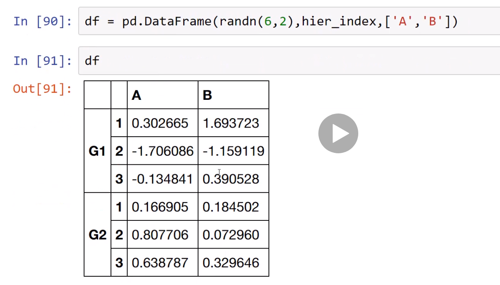
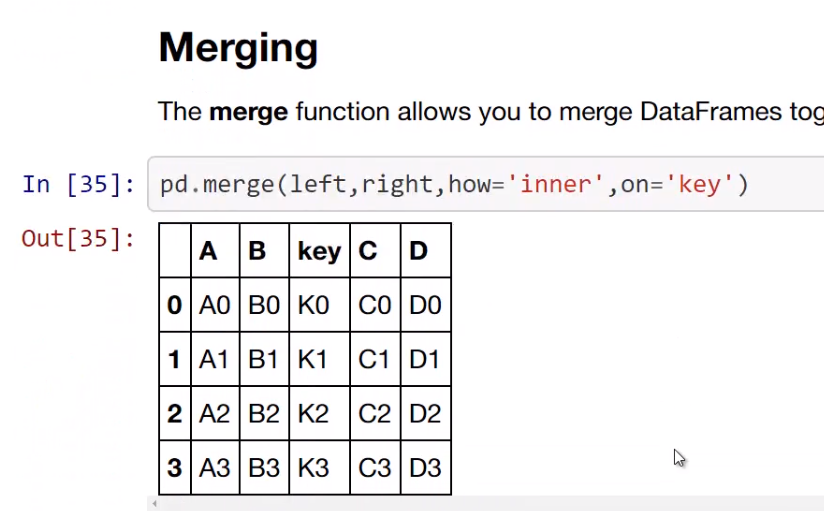
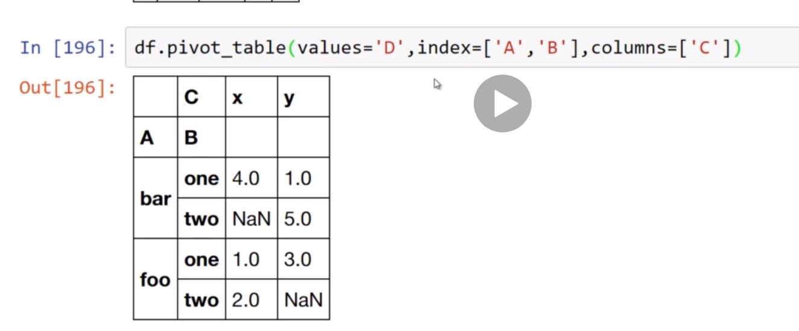

# Python for Data Science and Machine Learning Bootcamp
## Jose Portilla


# Introduction
- How to not suck, the basics.

# Environment Set-Up


# Jupyter Overview


# Python Crash Course


# Python for Data Analysis - NumPy


# Python for Data Analysis - Pandas
- Built on top of numpy.
- Sometimes called "Python's version of Excel" or "Python's version of Dataframes."
- You'll install pandas using `pip install pandas`.
- A **Series** is similar to and is built on top of a numpy Array.
- To create a series you will need:
  * List or array of data.
  * Labels for the indexes.
```python
pd.Series(data = <my_data>, index=<labels>)
```
- You can also pass a dictionary which will use the keys,values as the labels,data.
- The *Series* doesn't have to be numbers and you can even pass in built in funtions.
- The looks ups work like  hash table or a dictionary.
- Pulling data out is just like a python dictionary: by index.
- If you try to add *Series* with different indexes, then any non-matching values will be `NaN`.
- **Dataframes** will be the main tool while working with data in Python.
- For reproducability, you'll want to set a random number seed:
```Python
from numpy.random import randn
np.random.seed(101)
```
- To create one, you'll do:
```python
pd.DataFrame(<data>,<indexes>,<columns>)
```
- Each column in the *Data Frame* is really just a *Series*.
- Indexing starts with the column instead of the Row.
- If you want multiple columns back then pass the column names as a list.
- To add a column, you can define it as if it already exists:
```python
df['new'] = df['W'] + df['Y']
```
- If you want to drop a column from a *Dataframe* then you'll need to specify the axis:
```python
df.drop('new', axis=1)
```
- Remember that the drop does not happen in place and you will need to assign it to itself.
- Or, you can pass `inplace=True` as an argument.
- You can also use`df.loc[]` and pass in the label of the index to pull a column.
- You can also select by numeric indexes using `df.iloc[]`.
```python
df.loc['A']
df.iloc[0]
```
- To select rows, you can use these functions but will add a comma:
```python
df.loc['B','Y']
df.iloc[['A', 'B'], ['W', 'Y']]
```
- You can also run logical operators across all values.
- Usually, you don't want this so you'll apply it to a single column instead:
```python
df[ df['W']>0 ]
```
- This will avoid the `NaN` values from applying the operation to the entire *Dataframe*.
- You can also chain conditions together but you cannot use `and` and must use `&`.
- This is because `and` doesn't understand more than one value per side.
- If you call `df.reset_index()` then you will get the index as a column and the index re-numbered.
- If you want to set the index to a column that already exists, then use `df.set_index(<column-name>)`.
- *Dataframes* can have multiple levels in indexes.
- You can create them using `pd.MultiIndex.from_tuples()`
```python
outside = "G1 G1 G1 G2 G2 G2".split()
inside = [1,2,3,1,2,3]
heir_index = list(zip(outside,inside))
heir_index = pd.MultiIndex.from_tuples(heir_index)
```

- By default, the indexes wont have names but you can set those:
```python
df.index.names = ['Groups', 'Num']
```
- The function `df.xs()` will return a **Cross Section** of rows and columns from a multilevel index.
```python
df.xs('G1')
df.xs(1,level='Num')
```
- If you call `df.dropna()` then Pandas will drop any row,column with one or more missing values.
- You can also pass `thresh` argument to filter based on how many non-missing values exist.
- You can fill those missing values using `df.fillna()`.
- You can pass a `value=<value>` to set the replacement value.
- Filling in those values can be a challenging problem based on the data so you'll want to deal with that individually.
- The function `.groupby()` allows you to group together rows based off a column and perform an aggregate function on them.
```python
byComp = df.groupby('Company')
byComp.sum()
byComp.mean()
byComp.std()
```
- You can tranpose the *Dataframe* using `.transpose()`.
- **Concatenation** basically glues together *Dataframes*.
- You would do this using `pd.concat([df1, df2, ...])`.
- By default, it will try to join the rows together.
- You can ask it to join columns instead by passing `axis=1`.
- The function `pd.merge()` is using similar logic to SQL table joins:

- The parameter `how` allows you to select the merge type.
- The function `.join()` is a convenient method for combining the columns of two *Dataframes*.
- You can also join on the index keys.
- You can get the count of unique values in a column using `df.nunique()`.
- You can also get the actual number of values of each using `df.value_counts()`.
- A common but powerful design pattern is to use a lambda and the `df.apply()` to iterate through a column and run a custom function on the values.
- You can sort the *Dataframe* using `df.sort_values(by=<column-name>)`.
- You can create a pivot table from a *Dataframe* using `df.pivot_table()`.

- To deal with different kinds of data, you'll need some python packages:
  * `sqlalchemy`
  * `lxml`
  * `html5lin`
  * `Beautifulsoup4`
  * `xlrd`
- You can ingest a csv file using `pd.read_csv()`.
- You can also export to csv using `pd.to_csv()`.
- Note that you usually don't want to write the indexes so make sure to pass `index=False`.
- Pandas thinks a excel spreadsheet is just a bunch of dataframes.
- You will read in the file using `pd.read_excel('<filename>', sheetname = '<sheet-name>')`
- To read a webpage, you can use `pd.read_html('<url>')`.
- It will pull all the tables on the page and convert them to dataframes in a list.
- You can use the `sqlalchemy` package for basically any engine but there is usually a package for each engine you should use.


# Python for Data Analysis - Pandas Exercises


# Python for Data Visualization - Matplotlib


# Python for Data Visualization - Seaborn


# Python for Data Visualization - Pandas Built-in Data Visualization


# Python for Data Visualization - Plotly and Cufflinks


# Python for Data Visualization - Geographical Plotting


# Data Capstone Project


# Introduction to Machine Learning


# Linear Regression


# Cross Validation and Bias-Variance Trade-Off


# Logistic Regression


# K Nearest Neighbors


# Decision Trees and Random Forests
-

# Support Vector Machines


# K Means Clustering


# Principal Component Analysis


# Recommender Systems
- The two most common types of **Recommendar Systems** are:
  1. Content Based.
  2. Collaborative Filtering
- In the real world, *Collaborative Filtering* is what gets used.
- It can also be split into two subcategories:
  1. Memory-Based Collaborative Filtering.
  2. Model-Based Collaborate Filtering.
- There wont be a lecture walk through for the Advanced notebook due to the mathematical requirements.
- Walkthrough via video is not good for notes.


# Natural Language Processing


# Neural Nets and Deep Learning


# Big Data and Spark with Python


# Research:
- [Recommender Systems by Jannach and Zanker](https://www.amazon.com/Recommender-Systems-Introduction-Dietmar-Jannach-dp-0521493366/dp/0521493366)


# Reference:
