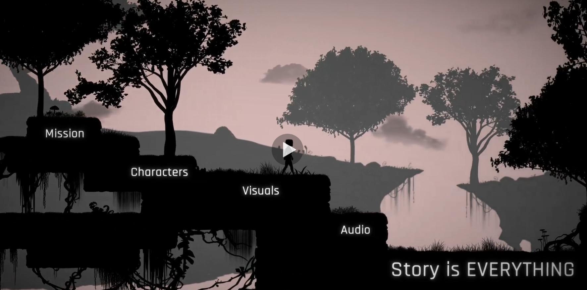
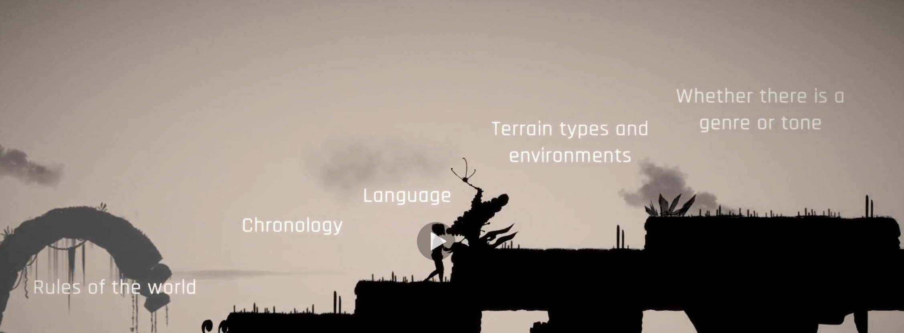
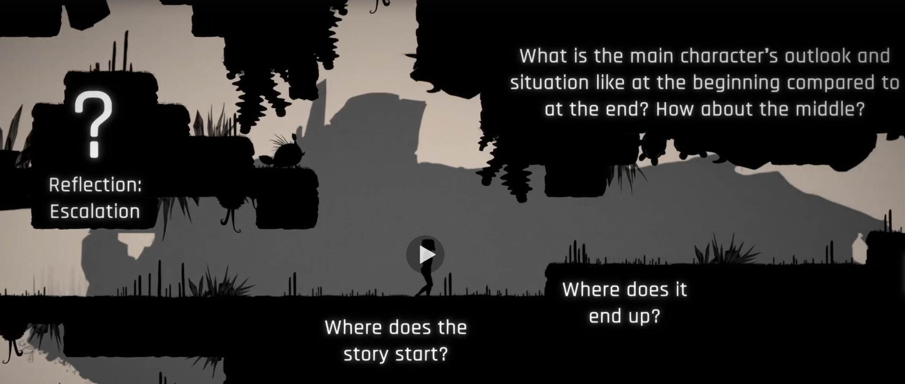
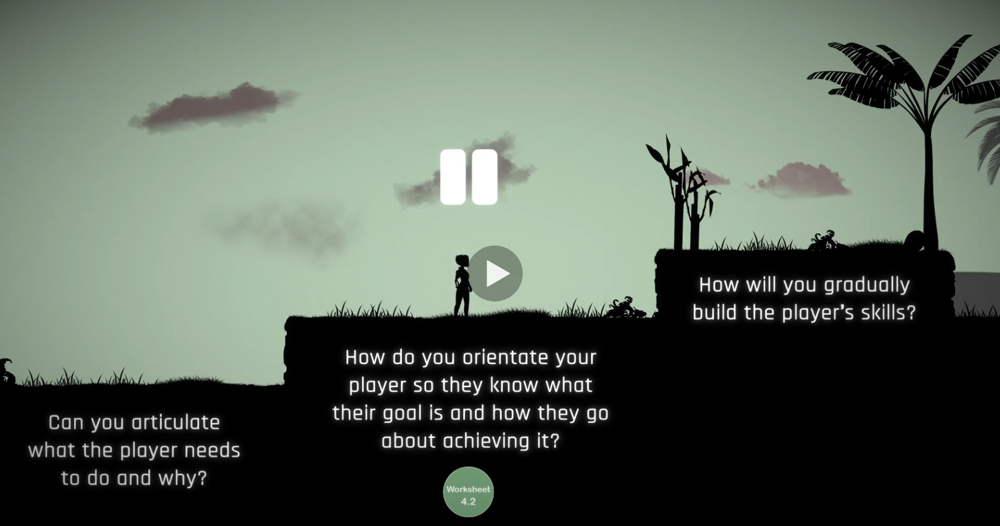
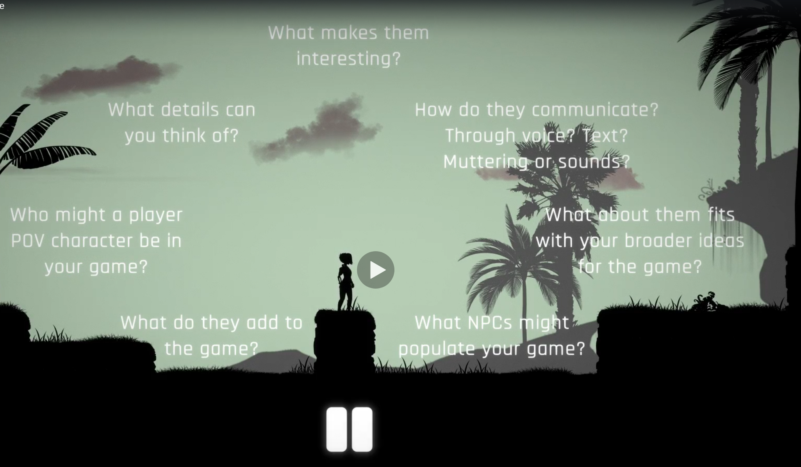
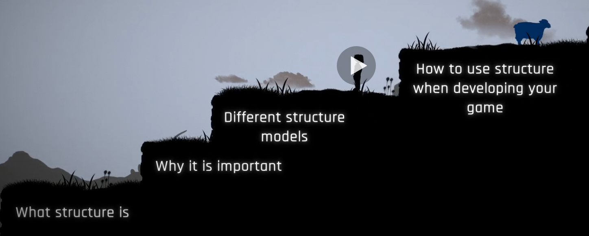
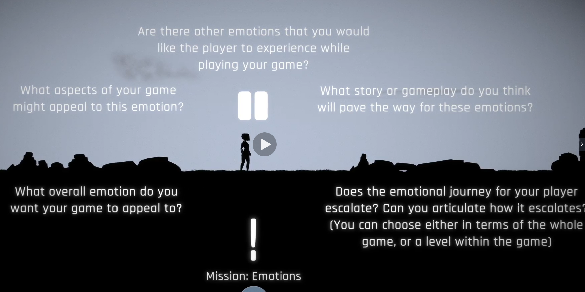

# Game Writing: Storytelling through Video Game Design
## Jenny Hide
## Gwen Davies

# 1. What is a Game?
- As Humans, telling stories is something we instinctively do.
- When a story is a passive medium - such as books, magazines - then the medium is under authorial control.
- Games are more active experiences - which is what makes them different.
- It is the player who navigates through the game.
- **Games** are interactive digital entertainment played on a computer, games console or other device.
- The lecturer's definition is:
> A Video game is a problem-solving activity, approached with a playful attitude, that is interacted with via a computer.

- It is separated from other mediums by interaction and choice.
- Players can create their own stories and variety of experiences.
- Principly, it is the set of possibilities laid out by the Story creator.
- Many games wont sit in a single category.
- **Game Mechanics** are the rules or methods designed for interaction with the game state thus providing gameplay.
- The less profound answer to why games have a story is that making them costs money and you should do it right from the start.
- The more profound answer is that story means purpose or meaning.
- **The Story is what makes the game make sense.**

> The player decides what to eat; the writer designs the menu.

# 2. Storytelling - The Basics
- You can use **Story Lite** vs **Story Rich** as a tool to decide what the story elements should look like.
- It could be a backdrop and not much else.
- The **Storyworld** is the entirety of hte world in which your story takes place.

- Questions?:
  1. What is interesting about the world?
  2. What are its rules?
  3. What does the society look like?
  4. what is the place and time?
  5. How did this world begin?
  6. What has shaped this world?
  7. What are the beliefs?
  8. What does nature look like here?
- The **Story** is all events that occur.
- The **Plot** is how and why these events are happening.
- The **Narrative** is how the story and plot are conveyed to the player.
- A *Story* must have a beginning, a middle and an end.
- Just as important as what the player is trying to achieve is what is in conflict with the player.
- What are the stakes for the Antagonist?
- Beware that the stake are not too big and too abstract.
- Often, a human element is what makes the story resonate.
- Equally important is the idea of **Escalation**.
- There needs to be a sense of evolution as you move through the game.

# 3. Start with an Idea!
- Sometimes ideas are disjointed and you'll have to flesh them out.
> There are no bad ideas.

- // **Incorrect**.
> Bad games are not usually a bad idea but a poorly developed idea.

- There is no one way to generate ideas.
- What are you responsible for in the game?
- Ideas often start with "What if?" or "Wouldn't it be cool if?".
- The whole point of being a story teller is to share them.
- You need to be able to communicate your game idea to others in order to get them interested.
- It can be a great exercise to explain your idea in a couple sentences or a paragraph.
- It can be useful to check out other games that are similar in idea.

# 4. Conveying Story Through Games
- Story can be expressed through:
  * The goal.
  * Game Mechanics.
  * Game Characters.
  * Dialogue.
  * Setting.
  * Level Design.
  * Sound Design.
- The **Goal** is what the player needs to do.
- The *goal* of the game is often the goal of the story.
- If the goal is the what the player needs to do; the *game mechanics* is how they achieve their goal.
> The most effective way to communicate how to do things is to weave the what and the how into the games instructions.

- Characters fall into two categories:
  1. POV characters.
  2. NPCs
- The characters need to fit within the style and tone of the game.

- **Level Design** is all the ingredients added into a level to make it what it is.
- Think about the player's journey:
  * What information do they have?
  * What is the best way to convey this information?
- **Sound Design** is incredible important as it makes the game immersive.
- **Exposition** is something that is story relevant is expressed.
- Too subtle and the player doesn't understand; to clunky and it will simply be a set of instructions laid out for the player.
- A **Cut Scene** is a short film within the game.
- A *Cut Scene* is best when it shows something that would be missed or cannot be done in gameplay.
- Make sure to convey ideas without simply saying them: "I'm so tired" vs "I'm low on energy."

# 5. Story Structure

- The best way to use **Structure Guidelines** are to use it to generate story events or characte development.
- As well as *Diagnostic Tools* for while you're developing your story further.
> Effective Stories are structured stories.

- **Structure** is the shape of progression.
- Effective stories have variety.
- A game with earned successes is usually the most fun.
- You want to keep in mind that you don't want a game that's hard enough that players never win.
- A game may not have an explicit "Level" but it can be seen to have "missions" which can be used as goalposts for progress.
- Pacing can be problematic for open world games when a player can choose any or no paths.
- It is helpful to keep in mind that the player's journey through the game is linear.
> Be aware of what makes na engaging and satisfying linear story when creating a game with branching stoyrlines
> // The player will still think of their experience as linear.

- If you have branches then your job is to make sure all paths have value.
- Beware of simply making sure that there is a singular theme with which to guide your story.
- **What core emotion do you want your game to appeal to?**

- Stories - almost always - need a beginning, a middle and an end.
- The **Beginning** or **Orientation** is the part of the story which tells us what the world of the story is.
- The **Middle** or **Comlications** is the part of the story where things get complicated for the Protagonist.
- The **End** or **Resolution** is where they face up to the Antagonist.
- Here is a model or structure to build stories around:
  1. **The Setup**: where we learn what the story  and game is about.
  2. **Catalyst**: Something which nudges the character into action.
  3. **Character In Action**: player starts the journey.
  4. **Inciting Incident**: This is what unbalances the player in some way.
  5. **Breathing Space**: A break from the main points.
  6. **Focus Point One**: Something that forces them to accept what is happening, learned.
  7. **Obstacles Tougher; Protagonist Stronger**.
  8. **Midpoint; Point of No Return**.
  9. **Focus Point Two**.
  10. **Onwards and Upwards**
  11. **The Moment of Truth**.
  12. **Resolving the Problem**
- The **Hero's Journey** is the structure of the character's progression.
- This tool is intended to be a way of identifying motifs in stories.

# 6. Developing Your Characters

# 7. Genre and Audienace Expectations

# Research:
- Zombies run?
- Miguel Sicart?
- Old Man's Journey?
- Christpher Vogler?
- "The Writer's Journey: Mythic Structures for Writers"

# Reference:
-
