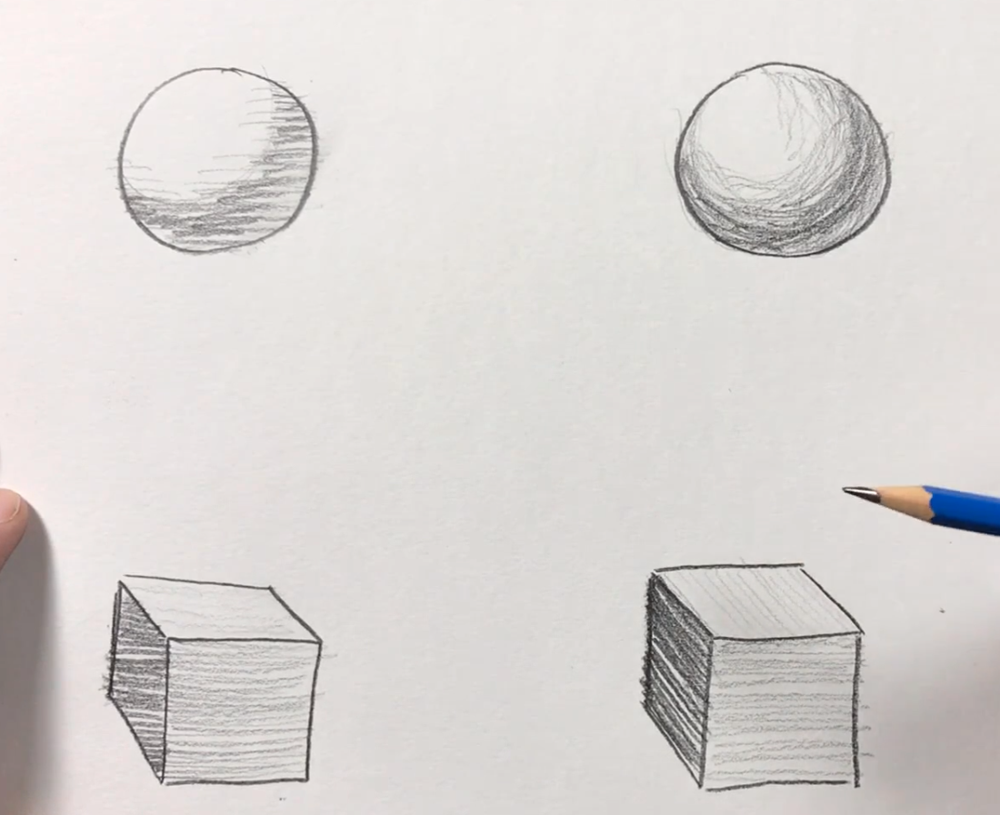
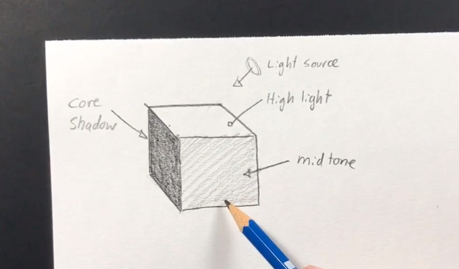

# The Ultimate Drawing Course - Beginner to Advanced
##

# Getting Started With the Course
- Make sure that you're actually practicing and doing the lessons.
- **Lines** are the fundamental of all drawing.
- They also gives perspective from the direction on the line.
- They can also create the expected motion of characters.
- **Shapes** are the next fundamental.
- There are four of them:
  1. Square.
  2. Circle.
  3. Triangle.
  4. Trapezoid
- The next fundamental is **Form** - which is the 3 dimensional part of drawing.
- While some shapes can give dimension on their own, some - like a sphere - would just look like a circle without shadow.
- The next is **Value** which is how light or dark something is.
- The last fundamental is **Perspective** which will really imbue your art with reality.
- You can use any paper or pencils for drawing but getting a sketchbook is probably best.
- Animators tend to draw with blue colored pencils.
- While you might think you don't need it, you really need a ruler for straight lines.
- Drawing is important because it is the building block of all art.
- Studios will take you for work if you can draw.
- It is also an easy - if not the easiest - way to convey and idea.

# Learn How to Draw a Realistic Eye
- You always want to start on the base before you worry about the details, otherwise they wont look good either.
- As you get towards the end of the drawing, you'll be able to darken the lines, but you'll want them to be light at the beginning.
- Make sure that your pencil is always sharp.
- The more contrast, the better your artwork will look.
- Drawing is about going over the drawing again and again, adding more detail as you go.

# Learning Line Fundamentals
- Now we'll talk about lines.
- There are lots of different kinds of lines.
- A **Contour Lines** are the lines that make up an image.
- While drawing them, you'll want to consider the thickness or thinness of the lines: called **Line Quality**.
- One of the biggest tips for making excellent art is a heavy emphasis on Contrast everywhere.
- Another way to sharpen your art skills is copying objects.
- People tend to make the common mistake of looking at their drawing too much and the object not enough.
- Eventually, you will be drawing out of your head but you'll want to work with real objects before that.
- **Cross Contour Lines** are lines used to create inside values of shapes.
- Instead of making contour lines straight, they should follow the form of the object.

# Learning Shape and Form Form Fundamentals
- *Shapes* are the second most important aspect of drawing.
- There are two kinds of shapes: **Orgranic** and **Geometric**.
- Geometric are exactly what you would think.
- An **Organic Shape** would be something without a well defined mathematical representation.
- From Geometric shapes, you create organic shapes; use the geometric shapes as a guide.
- **Negative Space** is the area where there is nothing from your shapes.
- They are very important since they help define the artwork.
- When drawing shadow, you need to consider where the source light coming from.
- You usually want to start on the **Core Shadow** or the darkest side first.
- Then, you work on the **Midtone Shadow** which is between the light source and the *Core Shadow*.

- Once done, worry about the **Cast Shadow**.
- You can lay down paper to prevent smudging while detailing.

# Learning Values and Contrast
- **Values** are how light or dark colors are.
- The value of colors next to a section have a large impact on how you perceive it.
- The value of a line has to do with the pressure you apply to the pencil.
- The **Focal Point** is where the eye is drawn to first.
- Draw this:

- **Contrast** is just the difference in values.
- The more contrast between points, the more it will draw a users eyes in.
- If you know where you want the focal point to be, then start there and create the most contrast first.

# Learning Space and Perspective

# Still Life Drawing

# Creating Textures in your Drawing

# Drawing the Human Face

# Drawing the Human Figure

# Animation Character Design

# Research:

# Reference:
